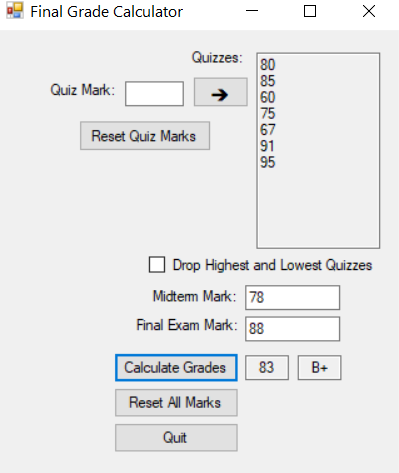

### Description

The application will allow the entry of an arbitrary number of quiz marks, a single midterm mark and the final examination mark. Once these have been entered, a calculate button would be pressed produce the final grade, which will be displayed in the window along with the corresponding letter grade. Note that there is no maximum or minimum number of quizzes.

### Snapshot
